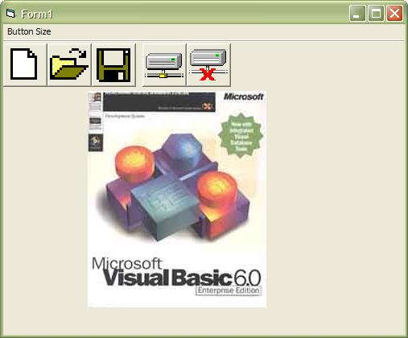



## Load an Image List from Resource

### Description

I hate maintaining ImageList controls, especially for larger projects where there might be several forms that can contain two or more of them on each form and have them same images. I prefer instead to use a Resource file for all resources and extract the items as needed. This provides faster load times for forms, creates smaller executables (since you only need one copy of each image), and becomes easier to maintain since all items are located in one place. (Notice there is no .frx file for this project) I loaded all images from the resource file and into the same ImageList control. I also added the capability in this sample to change the size of the toolbar buttons to show another advantage of doing it this way.
 
### More Info
 

             |
---                |---
**Submitted On**   |2004-12-15 10:59:44
**By**             |[james kahl](https://github.com/Planet-Source-Code/PSCIndex/blob/master/ByAuthor/james-kahl.md)
**Level**          |Beginner
**User Rating**    |4.4 (40 globes from 9 users)
**Compatibility**  |VB 5\.0, VB 6\.0
**Category**       |[Coding Standards](https://github.com/Planet-Source-Code/PSCIndex/blob/master/ByCategory/coding-standards__1-43.md)
**World**          |[Visual Basic](https://github.com/Planet-Source-Code/PSCIndex/blob/master/ByWorld/visual-basic.md)
**Archive File**   |[Load\_an\_Im18296212152004\.zip](https://github.com/Planet-Source-Code/james-kahl-load-an-image-list-from-resource__1-57737/archive/master.zip)

